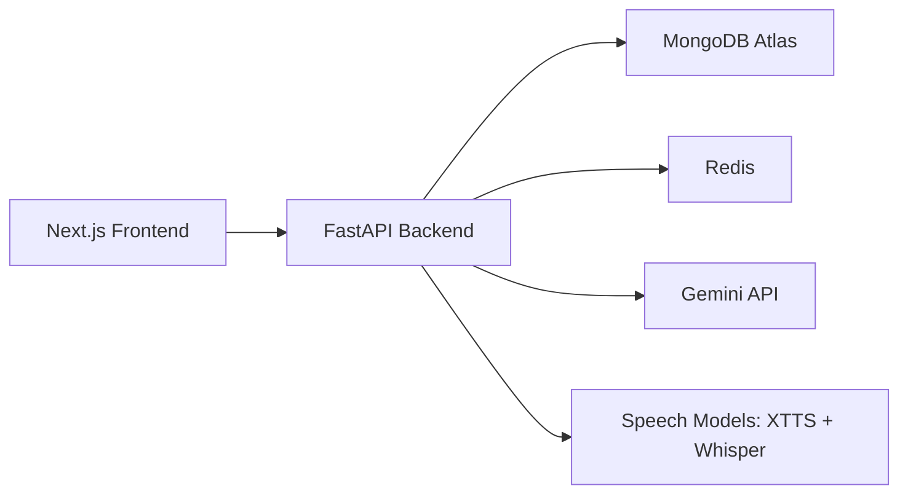
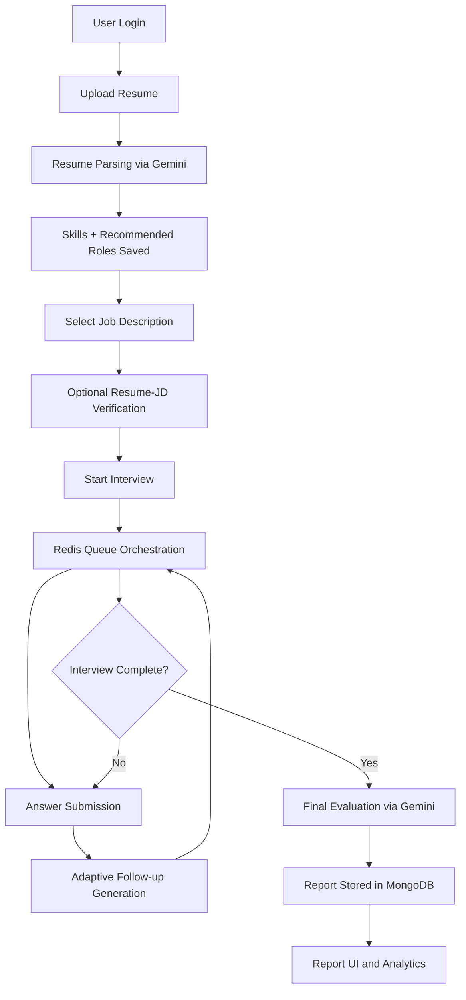

# Interview Bot - AI Mock Interview Trainer

An end-to-end AI-powered mock interview platform for students and job seekers.

Interview Bot combines resume intelligence, job-description alignment, adaptive questioning, speech interaction, and detailed post-interview evaluation in a single full-stack application.

The project includes:
- A FastAPI backend for auth, interview orchestration, speech services, analytics, and admin operations
- A Next.js frontend for student and admin workflows
- MongoDB Atlas for persistent records
- Redis for low-latency in-progress interview session state
- Gemini for resume parsing, follow-up generation, and final evaluation

---

## Table of Contents

1. [Problem Statement](#problem-statement)
2. [Project Overview](#project-overview)
3. [Key Features](#key-features)
4. [System Architecture](#system-architecture)
5. [Interview Engine Design](#interview-engine-design)
6. [Speech Pipeline](#speech-pipeline)
7. [Tech Stack](#tech-stack)
8. [Repository Structure](#repository-structure)
9. [Environment Configuration](#environment-configuration)
10. [Setup and Installation](#setup-and-installation)
11. [How to Run](#how-to-run)
12. [API Endpoints](#api-endpoints)
13. [Data Model](#data-model)
14. [Reliability and Resilience](#reliability-and-resilience)
15. [Troubleshooting](#troubleshooting)
16. [Deployment Notes](#deployment-notes)
17. [License](#license)

---

## Problem Statement

Most interview preparation tools are static and generic. They do not adapt to:
- A candidate's actual resume
- A specific target job description
- The quality and depth of previous answers

Interview Bot addresses this by generating dynamic, role-targeted interviews that adapt in real time and produce actionable feedback after completion.

---

## Project Overview

Interview Bot supports two interview modes:

1. Resume Interview
- Uses resume data + selected job description
- Creates personalized role-specific questions
- Applies adaptive follow-up logic per answer

2. Topic Interview
- Uses admin-published topics
- Supports optional timed interviews per topic
- Mixes topic bank questions with AI-generated follow-ups

The platform provides:
- Secure user authentication with JWT
- Resume upload and AI parsing
- AI-recommended role suggestions
- Resume-vs-job-description alignment checks
- Real-time interview state management via Redis queues
- Voice-enabled interviewing (TTS + STT)
- Detailed interview reports with per-question scoring
- Admin dashboards for analytics, content management, and user oversight

---

## Key Features

### Student Features

- Signup and login flow
- Resume upload (PDF/DOCX/TXT) and structured parsing
- Skill extraction and manual skill editing
- AI recommended role list from resume
- Personal job description management (create/update/delete)
- Pre-interview JD compatibility check
- Resume interview and topic interview modes
- Optional speech interaction:
	- Backend TTS question playback
	- Backend STT answer transcription
	- Editable transcript before final submit
- Report history and detailed report views

### Admin Features

- Role CRUD and requirement management
- Topic CRUD and publish/hide controls
- Optional per-topic timer configuration
- Resume/topic question CRUD
- Bulk question import from PDF using Gemini extraction
- Job description management across users
- User management (student deletion with related data cleanup)
- Analytics dashboard:
	- Total students
	- Live users
	- New users today
	- Average scores
	- Top performers
	- Common weak areas
- Quit interview monitoring and report auditing

---

## System Architecture

The platform is split into frontend and backend layers with AI and data services:



### High-Level Runtime Flow



---

## Interview Engine Design

Core orchestration lives in backend services and uses:
- Redis question queues and backlog lists
- LangGraph state flow for question generation
- Gemini for AI follow-up generation and final scoring
- Deterministic fallback questions when AI output is unavailable

### Resume Interview Flow

- Requires a resume and selected job description
- Starts with a personalized intro question
- Seeds an initial AI question batch in background
- Maintains max 10 questions by default
- Stores answers immediately and processes follow-up generation asynchronously

Queue-first strategy:
- `question_queue` keeps the next questions ready for low-latency response
- `question_backlog` stores overflow to avoid generation stalls
- Deduplication prevents repeated or near-duplicate questions

### Topic Interview Flow

- Requires a published topic
- Starts with DB topic question bank
- After initial stage, generates additional follow-ups
- Maintains max 10 questions
- Supports optional timer (configured per topic by admin)

### Follow-up Diversity Policy

Resume mode prevents repetitive drilling on the same skill/topic:
- Up to 2 consecutive same-topic follow-ups are allowed
- A third consecutive same-topic follow-up is allowed only when follow-up need score >= 95
- Otherwise, the system switches to an alternate focus skill

### Evaluation and Completion

- Per-answer evaluation can run in background while interview continues
- Final report is generated at completion (or partial report on quit if answers exist)
- Redis session data is cleaned after final report generation

---

## Speech Pipeline

Speech features are backend-powered for consistency across browsers:

### Text-to-Speech (TTS)

- Uses Coqui XTTS (`xtts_v2`) with warmup on startup
- Uses voice presets by gender (`female`, `male`, `auto`)
- Includes fallback synthesis models if XTTS fails transiently
- Audio caching improves repeat playback latency

### Speech-to-Text (STT)

- Uses `faster-whisper`
- Handles CUDA runtime issues and falls back to CPU automatically
- Returns transcription text + latency metrics

### UX Safeguards

- Spoken text normalization strips prefixes like `Question 3:` before playback
- Candidate can edit transcript before submission
- Frontend prefetches upcoming question audio where possible

---

## Tech Stack

### Backend

- FastAPI
- Uvicorn
- Motor (MongoDB async)
- redis-py asyncio client
- Pydantic + pydantic-settings
- python-jose + passlib + bcrypt
- Google Gemini (`google-genai`)
- LangGraph + LangChain Core
- Coqui TTS + faster-whisper
- pypdf + python-docx

### Frontend

- Next.js 16 (App Router)
- React 19 + TypeScript
- Tailwind CSS v4
- Axios
- React Query
- Framer Motion
- Sonner notifications
- Lucide icons

---

## Repository Structure

```text
interview-bot/
|- backend/
|  |- main.py
|  |- config.py
|  |- database.py
|  |- auth/
|  |- routers/
|  |- schemas/
|  |- services/
|  |- utils/
|  |- models/
|  |- uploads/
|  |- requirements.txt
|  |- Dockerfile
|- frontend/
|  |- src/
|  |  |- app/
|  |  |- components/
|  |  |- lib/
|  |  |- types/
|  |- public/
|  |- package.json
|- README.md
|- LICENSE
|- WORKFLOW.md
|- LANGGRAPH_AND_TOOLS.md
```

---

## Environment Configuration

Create and configure environment files before running.

### Backend: `backend/.env`

```env
# App
APP_ENV=development
APP_HOST=0.0.0.0
APP_PORT=8000

# Gemini
GEMINI_API_KEY=your_gemini_api_key
GEMINI_MODEL=gemini-2.5-flash
GEMINI_FALLBACK_MODELS=gemini-2.0-flash,gemini-2.0-flash-lite,gemini-flash-latest

# MongoDB (cloud only)
MONGO_URI=mongodb+srv://<user>:<password>@<cluster>/<db>?retryWrites=true&w=majority
MONGO_DB_NAME=interview_bot

# Redis (cloud URL)
REDIS_URL=rediss://:<password>@<host>:<port>

# JWT
JWT_SECRET=replace_with_strong_secret
JWT_ALGORITHM=HS256
JWT_EXPIRY=3600

# File storage
UPLOAD_DIR=./uploads

# Speech
COQUI_TOS_AGREED=1
XTTS_USE_GPU=auto
WHISPER_DEVICE=auto
```

Important validation rules in backend config:
- `MONGO_URI` must use `mongodb+srv://` and must not be localhost
- `REDIS_URL` must use `redis://` or `rediss://` and must not be localhost

### Frontend: `frontend/.env.local`

```env
NEXT_PUBLIC_API_URL=http://127.0.0.1:8000
```

---

## Setup and Installation

### Prerequisites

- Python 3.10+
- Node.js 18+
- npm
- MongoDB Atlas instance
- Cloud Redis instance
- Gemini API key

### 1) Clone Repository

```bash
git clone <your-repo-url>
cd interview-bot
```

### 2) Backend Setup

```bash
cd backend
python -m venv ../inter
..\inter\Scripts\activate
pip install -r requirements.txt
```

Linux/macOS equivalent:

```bash
python -m venv inter
source inter/bin/activate
pip install -r backend/requirements.txt
```

### 3) Frontend Setup

```bash
cd ../frontend
npm install
```

---

## How to Run

### Start Backend API

From `backend/` directory:

```bash
uvicorn main:app --host 0.0.0.0 --port 8000 --reload
```

Backend endpoints:
- API root health: `http://localhost:8000/health`
- Swagger docs: `http://localhost:8000/docs`

### Start Frontend

From `frontend/` directory:

```bash
npm run dev
```

Frontend app: `http://localhost:3000`

### First Run Checklist

1. Register a user account
2. Upload resume in Settings
3. Add at least one Job Description
4. Start Resume Interview from Dashboard or Bot's Help
5. Complete interview and open Reports

---

## API Endpoints

All secured endpoints require `Authorization: Bearer <token>`.

### Health

| Method | Path | Description |
|---|---|---|
| GET | `/health` | Service health check |

### Authentication

| Method | Path | Description |
|---|---|---|
| POST | `/auth/signup` | Register user |
| POST | `/auth/login` | Login and receive JWT |

Note: By default, emails ending with `@admin.com` are created with admin role.

### Resume

| Method | Path | Description |
|---|---|---|
| POST | `/resume/upload` | Upload and parse resume |

### Profile

| Method | Path | Description |
|---|---|---|
| GET | `/profile` | Get profile, resume, skills |
| PUT | `/profile/speech-settings` | Update voice preference |
| PUT | `/profile/skills` | Update user skill list |
| PUT | `/profile/resume-data` | Update structured resume fields |
| GET | `/profile/job-descriptions` | List user's JDs |
| POST | `/profile/job-descriptions` | Create JD |
| PUT | `/profile/job-descriptions/{jd_id}` | Update JD |
| DELETE | `/profile/job-descriptions/{jd_id}` | Delete JD |

### Interview

| Method | Path | Description |
|---|---|---|
| POST | `/interview/start` | Start interview session |
| POST | `/interview/start_interview` | Compatibility alias for start |
| POST | `/interview/verify` | Resume-vs-JD verification |
| POST | `/interview/answer` | Submit answer and get next question |
| POST | `/interview/submit_answer` | Compatibility alias for answer |
| GET | `/interview/next_question` | Peek next queued question |
| POST | `/interview/quit` | Quit interview; optional partial report |
| GET | `/interview/report` | Generate/get report |
| GET | `/interview/latency` | Latency summary (p50/p95) |
| POST | `/interview/latency/reset` | Reset latency metrics |

### Reports

| Method | Path | Description |
|---|---|---|
| GET | `/reports/history` | Student report history |

### Speech

| Method | Path | Description |
|---|---|---|
| GET | `/speech/health` | Speech service health |
| POST | `/speech/warmup` | Warm TTS/STT models |
| POST | `/speech/synthesize` | Convert text to WAV |
| POST | `/speech/transcribe` | Transcribe uploaded audio |

### Admin (selected)

| Method | Path | Description |
|---|---|---|
| GET/POST/PUT/DELETE | `/admin/roles` (+ `/{id}`) | Role management |
| GET/POST/PUT/DELETE | `/admin/questions` (+ `/{id}`) | Question management |
| POST | `/admin/questions/upload` | Import questions from PDF |
| GET/POST/PUT/DELETE | `/admin/topics` (+ `/{id}`) | Topic management |
| PUT | `/admin/topics/{topic_id}/publish` | Publish/hide topic + timer |
| GET/POST/DELETE | `/admin/requirements` | Role requirement management |
| GET | `/admin/analytics` | Admin dashboard analytics |
| GET | `/admin/quit-interviews` | Quit interview details |
| GET | `/admin/reports` | Report summaries |
| GET | `/admin/reports/{session_id}` | Report detail |
| GET | `/admin/users` | Student list |
| DELETE | `/admin/users/{user_id}` | Delete student and linked data |
| GET/POST/PUT/DELETE | `/admin/job-descriptions` | Admin JD management |

---

## Data Model

Primary MongoDB collections:

- `users`
- `resumes`
- `skills`
- `job_roles`
- `job_descriptions`
- `jd_verifications`
- `role_requirements`
- `questions`
- `topics`
- `topic_questions`
- `sessions`
- `answers`
- `results`

Redis stores in-progress interview state with TTL, including:
- Session metadata
- Question queue/backlog
- Asked question fingerprints
- Q/A hashes
- Context cache

---

## Reliability and Resilience

This project includes multiple runtime safeguards:

- Gemini model fallback chain for transient provider failures
- Retry logic for 503/high-demand conditions
- Loose JSON extraction/parsing to recover from malformed model output
- Deterministic fallback question templates when AI output is empty/duplicate
- Question deduplication using normalized fingerprinting
- Queue/backlog buffering to avoid blocking next question delivery
- Placeholder report detection and regeneration logic
- Report generation fallback from MongoDB answers when Redis session data is unavailable
- TTS and STT warmup with graceful fallback paths
- STT automatic CPU fallback on CUDA runtime issues

---

## Troubleshooting

### 1) Login fails despite valid credentials

Symptom:
- Frontend shows auth error even though credentials are correct.

Likely cause:
- Frontend cannot reach backend API.

Fix:
1. Ensure backend is running on the configured host/port.
2. Verify `frontend/.env.local`:
	 - `NEXT_PUBLIC_API_URL=http://127.0.0.1:8000`
3. Restart frontend after changing env.

### 2) Resume interview start fails

Check:
- Resume is uploaded
- Job Description is selected
- Job Description includes `required_skills`

### 3) No recommended roles in Start Interview dropdown

Check:
- Resume parsing succeeded
- `recommended_roles` exists in profile resume parsed data

If missing, re-upload resume from Settings.

### 4) Speech is slow on first request

Use:
- `POST /speech/warmup` after login

The frontend also warms speech automatically, but manual warmup helps during diagnostics.

### 5) Mongo/Redis config validation errors at startup

Ensure:
- Mongo uses `mongodb+srv://`
- Redis uses `redis://` or `rediss://`
- Neither uses localhost in current backend validation rules

### 6) CUDA errors during transcription

The service automatically falls back to CPU. Transcription will continue but can be slower.

---

## Deployment Notes

- Backend includes a Dockerfile (`backend/Dockerfile`)
- Configure production secrets via environment variables
- Use strong JWT secret in production
- Restrict CORS origins for production deployments
- Ensure cloud MongoDB/Redis endpoints are reachable from deployment network

Example backend container run:

```bash
cd backend
docker build -t interview-bot-backend .
docker run -p 8000:8000 --env-file .env interview-bot-backend
```

---

## License

This project is licensed under the MIT License.
See [LICENSE](LICENSE) for details.